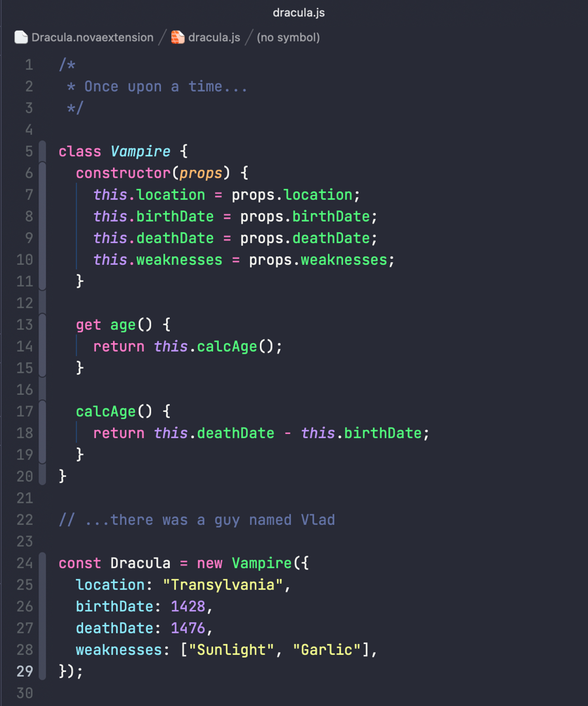

# Dracula for [Nova](https://nova.app)

> A dark theme for [Nova](https://nova.app).

## Install

1. Go to Preferences in Nova
2. Go to the Theme tab
3. Click the "More Themes" button
4. Search for "Dracula"
5. Click the Install Button
